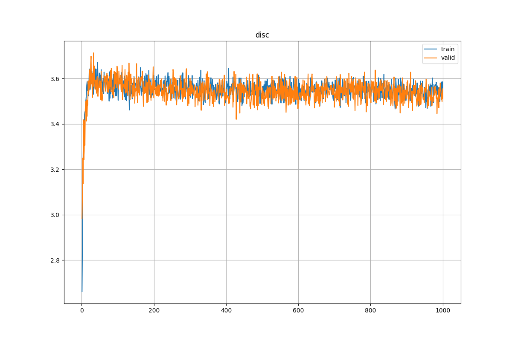
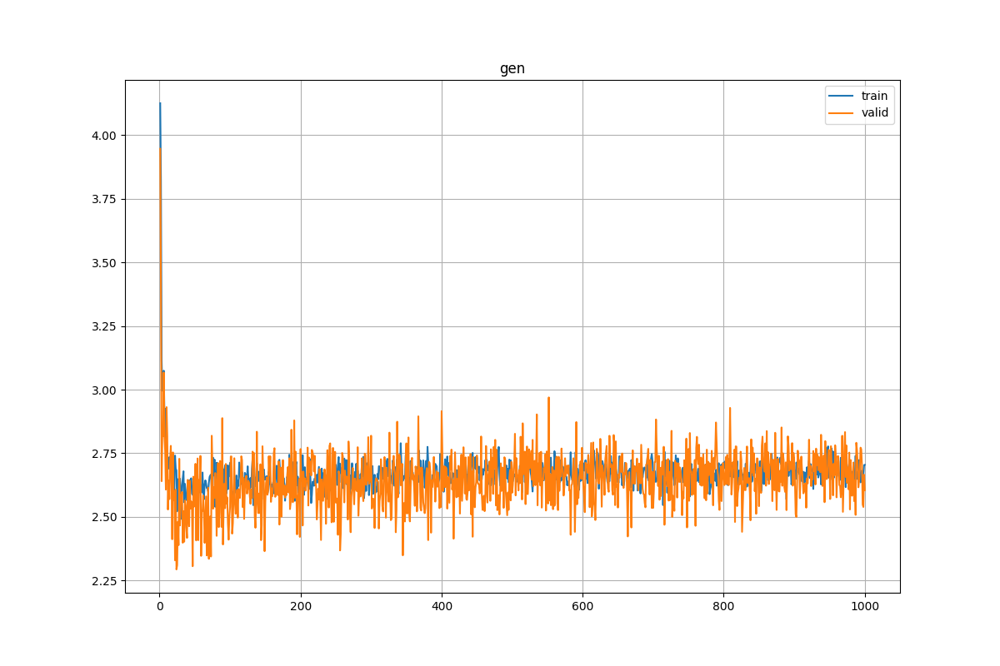
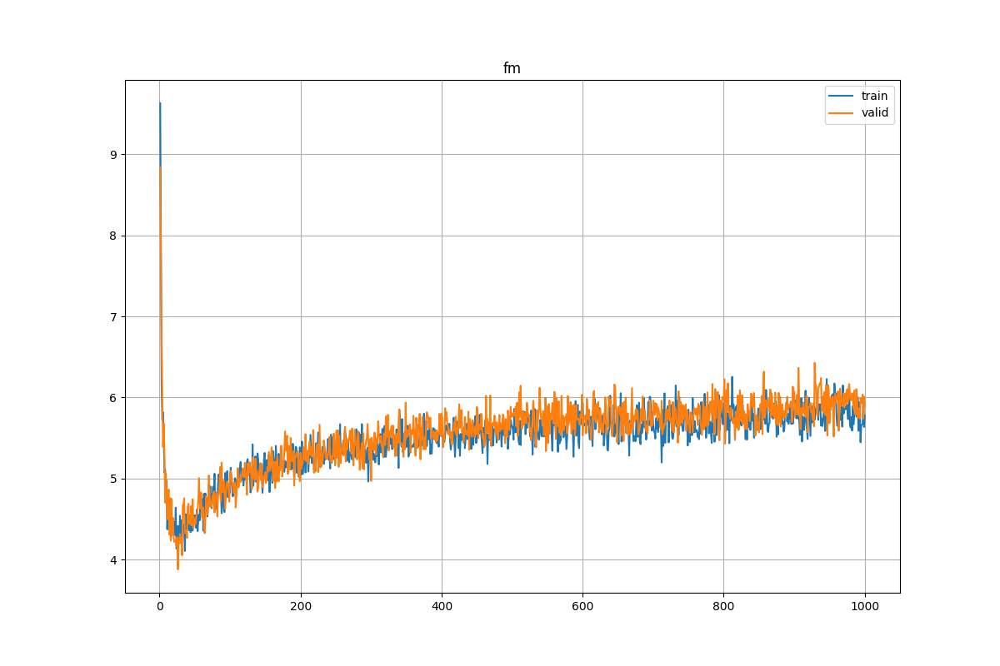
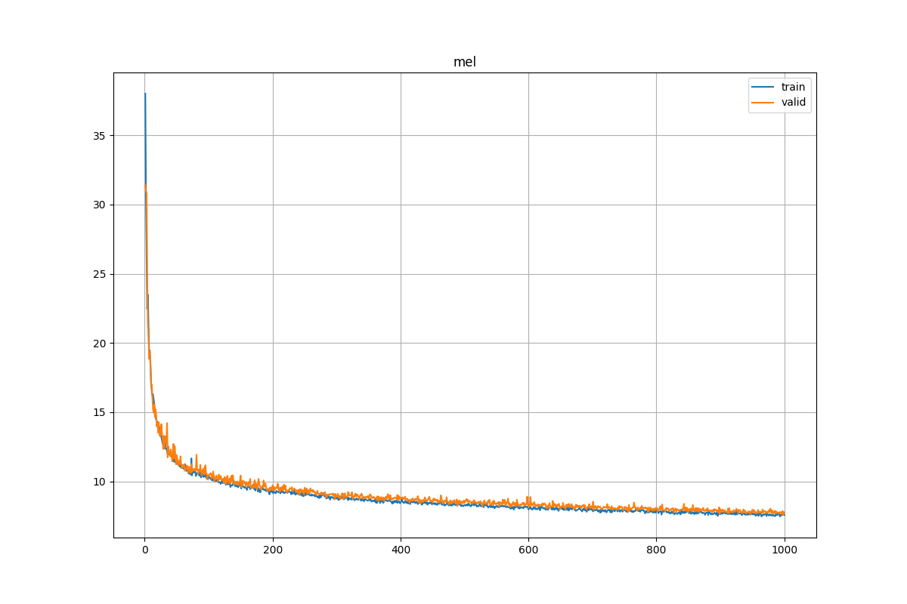

# BigVGAN

My implementation of BigVGAN-base([paper](https://arxiv.org/abs/2206.04658)) for JSUT([link](https://sites.google.com/site/shinnosuketakamichi/publication/jsut)) powerd by lightning.


The differences between HiFi-GAN([my implementation](https://github.com/reppy4620/hifi_gan)) and this are
- Activation is replaced by AntiAliasActivation, which is composed of 2xUpsample, Snake, 2xDownsample, instead of LeakyReLU.
- Remove pre-activation of each ConvTranspose1d w.r.t. paper.
- Segment size = 32 instead of 64 because VRAM is exhausted.

# Usage
Running run.sh will automatically download the data and begin training.  
So just execute the following commands to begin training.

```sh
cd scripts
./run.sh
```

synthesize.sh uses last.ckpt by default, so if you want to use a specific weight, change it.

```sh
cd scripts
./synthesis.sh
```

# Requirements

```sh
pip install torch torchaudio lightning pandas
```

# Result

Trained 1000 epochs(612000 steps) with batch_size = 16.

Pretrained model ckpt is here.
[https://huggingface.co/reppy4620/hifi_gan_jsut/blob/main/jsut_1000.ckpt](https://huggingface.co/reppy4620/big_vgan_jsut/blob/main/jsut_1000.ckpt)

Some audio samples are in `asset/sample/`

| loss | plot |
| --- | --- |
| Discriminator |  |
| Generator |  |
| Feature Matching |  |
| Mel |  |
